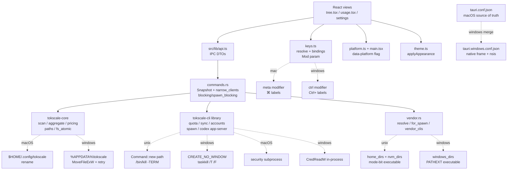

# Windows port specification

**Status:** as-built. The port described here is implemented on `main`
(phases 1–5 merged, ADR 0009 accepted, fork tag `gui-v4.15.1-lib.6`).
This document is the specification those changes implement: it records the
traced architecture, every macOS assumption with its disposition, the target
module map, the Windows behavior decisions with their evidence, and the
verification that is still native-only. Items marked 🪟 can only be proven on
native Windows and are the remaining work.

**Scope:** Windows 10 1809+ and Windows 11, x64 only. No Linux, no arm64, no
redesign of reports or domain language, no updater.

**Read first:** `CONTEXT.md`, `ROADMAP.md`, `docs/adr/0009-windows-port.md`,
`docs/windows-port/` (the phase runbook this spec covers).

---

## 1. Executive decision summary

The GUI calls `tokscale-core` and `tokscale-cli` in-process; both crates
already support Windows (Credential Manager reads, `%APPDATA%` paths,
Cursor's `state.vscdb`, Copilot's wincred targets, atomic file replacement).
So the port is six small platform seams, not a rewrite:

| # | Decision | Evidence |
|---|---|---|
| 1 | Window differences live in `src-tauri/tauri.windows.conf.json`, merged over an untouched `tauri.conf.json` | Tauri 2 platform config merge; Phase 1 |
| 2 | Native Windows frame, opaque sidebar, no Mica/Acrylic | Mica is Windows-11-only; the scrim was designed for macOS vibrancy |
| 3 | `vendor.rs` gains a Windows adapter: `PATHEXT` extension search plus `%APPDATA%`/scoop/winget/npm candidate dirs, same `OnPath`/`OffPath`/`NotInstalled` type | ADR 0006; Phase 2 |
| 4 | Fork `spawn::command` sets `CREATE_NO_WINDOW`; `codex app-server` teardown uses `taskkill /T /F` | GUI-subsystem parent spawns console children otherwise; `codex.cmd` chains `cmd.exe` → node → `codex.exe` |
| 5 | Shortcuts take Ctrl in place of ⌘ via a `Mod` parameter; labels read `Ctrl+…`; Ctrl+R stays the webview's reload | ADR 0003 bindings unchanged; Phase 4 |
| 6 | NSIS `currentUser` installer, WebView2 `downloadBootstrapper`, no MSI, no updater, unsigned artifacts | README download table; owner questions Q1 (signing), Q2 (arm64) |
| 7 | Everything else (scan, reports, pricing, quota, sync, accounts, settings, theme) is already portable or portable through the vendored crates | Inventory §3: 14 findings take a Windows adapter, 28 need no GUI-layer change |

Rejected alternatives are recorded beside each decision in §5–§6.

---

## 2. Current architecture and traced flows

### 2.1 Shape

```
React 19 views ── src/lib/api.ts ── Tauri IPC (hand-written DTOs, dto.rs)
        │
        ▼
src-tauri/src/commands.rs ── Snapshot: Mutex<Option<Vec<UnifiedMessage>>> in tauri::State
        │                         reports re-aggregate from it (41–100 ms); only scan rescans (21–40 s cold)
        ├── tokscale-core (scan, aggregate, pricing, paths, fs_atomic)
        └── tokscale-cli  (quota fetchers, cursor/antigravity/trae sync, accounts, spawn, codex app-server)
```

Every command is `async` and runs on `spawn_blocking` (`commands::blocking`),
because a cold scan on the async runtime starves every other command
(`commands.rs:111-120`, `lib.rs:7-9`). The 23 Tauri commands registered in
`lib.rs:67-91` are: `scan`, `model_report`, `graph_report`, `hourly_report`,
`minutely_report`, `agents_report`, `clients`, `client_catalog`, `unpriced`,
`custom_pricing`, `set_custom_pricing`, `clear_custom_pricing`,
`vendor_clis`, `quota`, `sync`, `sync_status`, `accounts`, `add_account`,
`switch_account`, `remove_account`, `codex_activity`, `gui_settings`,
`set_gui_settings`.

The GUI crate itself spawns **no** child process: `vendor.rs` only resolves
paths, and every spawn goes through the fork (`tokscale_cli::spawn::command`,
`helpers::read_keychain`'s `security` subprocess on macOS,
`codex_activity`'s app-server child). The resolver is installed once in
`run` (`lib.rs:47`: `tokscale_cli::spawn::set_resolver(vendor::for_spawn)`).

### 2.2 Flow traces

Each row names module → interface → side effects → OS assumptions →
error modes → existing tests.

**F1 — Initial launch and first scan.**
`main.rs` (`windows_subsystem = "windows"` in release, so no console window)
→ `lib.rs::run` (installs spawn resolver, holds `Snapshot::default()`,
arms the 1500 ms `SHOW_FALLBACK` thread that shows the window if the
frontend never does) → frontend `main.tsx` sets `data-platform` from
`navigator.userAgent`, reads `gui_settings`, applies appearance, invokes
`scan(undefined, forced=false)`. `scan` runs `priced_parse` with
`Filter::default().parse_options()`: `home_dir: None, use_env_roots: true`
(core resolves roots from the environment), `clients: Some(enabled_clients())`
(every `parse_local` Client plus Cursor, constant — ADR 0005), and
`scanner_settings: settings::scanner()` (read-only read of the `scanner` key
in `settings.json`). Side effects: reads every client's transcripts on disk,
writes core's on-disk message/pricing caches under the config dir. OS
assumptions: none in the GUI layer — roots, transcript locations and cache
paths all come from core's `paths`/`scanner` modules, which carry the
Windows branches. Error modes: missing/unreadable `settings.json` degrades
to defaults (`settings.rs:40-42`); a scan over an empty machine yields an
empty Snapshot and the first-run panel. Tests: `settings.rs` (scanner key
mapping, `defaultClients` exclusion, broken-file degrade),
`sync.rs::real_sync_reaches_the_scan` (ignored, proves sync rows reach the
Snapshot), frontend `scan-state.ts` first-run predicate
(`!hasSummary && isScanning`, 120 ms settle against webview-reload flash).

**F2 — Refresh and auto-refresh.** `refreshScan` in `use-scan.ts` (single
owner of `force`/`abandoned` module state) → `scan(undefined, forced=true)`,
which replaces the Snapshot. Interval refresh (default 60 s, bounds
30 s–1 h, off by default) reuses the same path; #38 measured a warm forced
scan at ~214 ms. **Abandon** stops waiting; the scan completes and still
warms the cache. OS assumptions: none. Tests: `use-scan` behavior is covered
by frontend tests; the warm-scan figure is recorded on #38, not asserted.

**F3 — Report queries and filters.** `model_report`, `graph_report`,
`hourly_report`, `minutely_report`, `agents_report`, `clients`,
`client_catalog`, `unpriced` re-aggregate from the held Snapshot, except
`graph_report`, which re-enters the parse through core's private `GraphSink`
— but only after a Scan has warmed the on-disk cache (0.28 s cold /
0.76 s warm release, #27). The Report Filter's `clients` narrowing is
honoured by two mechanisms: `narrow_clients` in the command layer for the
Snapshot path (core's report-time predicate never consults `clients`),
and as a parse input for the graph path (`commands.rs:70-91`). OS
assumptions: none. Bucket timezone comes from the read-only scanner
settings; day/hour folding is core's. Tests:
`a_client_narrowing_is_inert_against_the_held_snapshot`,
`daily_detail_agrees_with_the_daily_row` (0.0 delta across narrowings),
`ramp_level` bucketing, calendar fill in `src/lib/calendar.ts`.

**F4 — Vendor quota reads.** `usage::quota` → fork
`fetch_all_report_and_unconfigured(UsageFetchIntent::CliReadOnly)` — read-only
on purpose: the TUI intent would import the current Codex login into the
account store (`usage.rs:13-17`). Each provider fetches on a thread the fork
owns; `antigravity::has_credentials` builds its own runtime on the calling
thread, so the command must not enter a runtime (`usage.rs:18-21`).
Side effects: network to each provider's API; writes the single-file
subscription cache when at least one fetch succeeded; reads any-age cache for
stale cards when everything failed. Credential reads: macOS `security`
subprocess vs Windows `CredReadW` in-process (`helpers.rs:25-50`) — both
inside the fork, invisible to the GUI. OS assumptions: none in the GUI.
Error modes: per-provider `failed` cards with diagnostics; `notSetUp` names
(never an error); all-failed with a cache on disk shows stale cards with
`stale_since`. Tests: `usage.rs` mapping tests (fresh/failed/stale,
diagnostic beside the provider's card); `real_quota_fetch` (ignored, prints
states and counts, never figures); fork `copilot.rs` wincred target/probe
tests, `helpers.rs` blob-decode and Windows-only Credential Manager
round-trip tests (`windows_wincred_tests`, target-gated).

**F5 — Account discovery and switching.** `accounts`, `add_account`,
`switch_account`, `remove_account`, `codex_activity` → fork `cursor` and
`codex` credential stores — the same files the CLI/TUI use; tokens never
cross IPC (`accounts.rs:1-3`). Cursor add reads the desktop login from
`state.vscdb` (SQLite read, no network), validates, saves. Codex add imports
the CLI's current login; switch rewrites the codex CLI's `auth.json`, which
is what makes the next quota fetch see the account as active. `codex_activity`
spawns `codex app-server` through `vendor::for_spawn` (seconds when it
answers, up to ten when it doesn't). OS assumptions: GUI none; fork owns the
`state.vscdb` candidate paths (macOS `~/Library/…`, Windows
`%APPDATA%\Cursor\…` fallback plus home-rooted `AppData/Roaming/…`,
`cursor.rs:337-365`) and the app-server teardown (`/bin/kill -TERM` vs
`taskkill /T /F`, both behind `cfg`). Error modes: `notSetUp` ("Run
`codex login`…", "Sign in to the Cursor app…"), `failed` with the fork's
message; Codex refuses to remove the active account. Tests: outcome-mapping
unit tests; `real_codex_activity` (ignored) must print `available` on a
signed-in machine.

**F6 — Cursor, Antigravity and Trae sync.** `sync(provider)` /
`sync_status()` → fork `sync_cursor_cache` (async, `block_on` inside
`blocking`), `sync_antigravity_cache` (plain `fn`, own threads/runtime —
called with nothing around it), `trae::sync::sync_trae` (async, variants
filtered to those with credentials or a desktop login). The frontend never
starts a sync while a scan runs; Refresh goes through `refreshScan` after a
successful sync. `sync_status` reads newest-mtime under each provider's cache
dir. OS assumptions: GUI none; fork owns Antigravity language-server process
discovery and the Trae/Cursor cache locations. Error modes: `synced` (with
partial-failure message when some accounts failed), `notSetUp` ("Antigravity
isn't running…", "Sign in to the Trae app…"), `failed`, `unknown sync
provider`. A Cursor sync re-activates the desktop app's login (ADR 0007).
Tests: `of_cursor` / `of_antigravity` / `of_trae` mapping tests;
`real_sync_reaches_the_scan` (ignored, proves synced rows reach the Snapshot
and that core's default client set has no Cursor lane).

**F7 — Pricing refresh and local overrides.** `custom_pricing` /
`set_custom_pricing` / `clear_custom_pricing` edit
`<config_dir>/custom-pricing.json`, the same file the CLI/TUI read; saves
merge rather than replace so hand-written tiers survive (`pricing.rs:96-123`).
Pricing datasets (LiteLLM, OpenRouter, models.dev) refresh through core's
`PricingService`; after an edit a forced rescan builds a fresh service via
`pricing::reloaded()` because `get_or_init` caches process-wide
(`pricing.rs:205-223`). Writes go through `write_json`: temp file in the
same directory plus `tokscale_core::fs_atomic::replace_file`
(`pricing.rs:188-203`) — plain `rename` on unix, `MoveFileExW` with
`REPLACE_EXISTING | WRITE_THROUGH` and retry on `ERROR_ACCESS_DENIED` /
`ERROR_SHARING_VIOLATION` on Windows (`fs_atomic.rs`), so AV/indexer locks
don't surface one-shot failures. Broken-file policy is asymmetric on purpose:
pricing refuses to clobber an unparseable file (it writes), while
`settings.rs` and `gui.rs` degrade to defaults (they only read). OS
assumptions: GUI none — atomicity and lock behavior live in core. Tests:
key-name pinning against core's reader, merge/no-flatten, `0.0`-kept,
empty-entry removal, write-refuses-broken-file.

**F8 — GUI settings load and save.** `gui_settings` / `set_gui_settings` →
`gui.json` under Tauri's `app_config_dir()` (`%APPDATA%\dev.bunnygamezsc.tokscale-gui\`
on Windows, `~/Library/Application Support/…` on macOS). One writer (the
GUI), per-key fallback to defaults, interval clamping, unknown-key
preservation (`gui.rs:52-86`). The frontend reads settings before showing the
window so the first frame wears the saved appearance. OS assumptions: none —
the config-dir lookup is Tauri's. Error modes: absent/unparseable file reads
as defaults; a save over a broken file repairs it. Tests: `gui.rs`
(defaults, per-key fallback, clamping, unknown-key preservation,
absent/broken-file behavior).

**F9 — Vendor CLI discovery and invocation.** `vendor_clis` → pure
`resolve(name, path_dirs, extra_dirs, exts)` over the six bare names upstream
spawns (`codex`, `gh`, `kiro-cli`, `gemini`, `claude`, `grok` — counted from
fork call sites, `vendor.rs:21-30`) → `OnPath` / `OffPath` / `NotInstalled`
rows in the sidebar sheet. `vendor::for_spawn` gives the fork the resolved
absolute path (or the bare name when missing, so the spawn fails the way a
shell's would); the fork prepends the binary's own directory to the child's
`PATH` (closes nvm's interpreter gap) and, on Windows, sets
`CREATE_NO_WINDOW` (`spawn.rs:24-40`). Rust std ≥1.77 runs `.cmd`/`.bat`
through `cmd.exe` with safe argument escaping — no shell wrapper, and the
args here are fixed literals. OS assumptions: all isolated in `vendor.rs`
(`executable`, `executable_extensions`, `extra_dirs`/`windows_dirs`) and the
two `cfg(windows)` blocks in the fork. Error modes: `NotInstalled` (user
installs) vs `OffPath` (app spawns the absolute path) — deliberately not one
failure (ADR 0006). Tests: §8 matrix rows V1–V7.

**F10 — Theme selection and window reveal.** `applyAppearance`
(`src/theme.ts`) writes Tauri `setTheme` and `data-theme` together — theme is
a window state, not a CSS class, because `windowEffects` materials follow
`NSAppearance`. The window is created hidden (`visible: false` in both
configs); the frontend shows it after applying the saved appearance, and
`lib.rs`'s 1500 ms fallback thread shows it if the frontend fails. On
Windows `setTheme`/`theme`/`onThemeChanged` are cross-platform Tauri 2
(Runbook Phase 4, step 5: no change). OS assumptions: none — verified, not
adapted. Tests: frontend theme-behavior tests; 🪟 smoke row 5 (System follows
Windows app mode).

---

## 3. Portability inventory

Classification: **P** already portable · **V** portable through the vendored
crates · **A** needs a Windows adapter (in GUI unless noted) · **R** shared
refactor · **D** product decision · **O** verification only.

| # | Finding (file : symbol) | Class | Disposition |
|---|---|---|---|
| 1 | `tauri.conf.json`: `titleBarStyle Overlay`, `hiddenTitle`, `trafficLightPosition`, `transparent: true`, `windowEffects: [sidebar]` | A | `tauri.windows.conf.json` replaces the whole `app.windows` entry (arrays replace wholesale under JSON Merge Patch) |
| 2 | `tauri.conf.json` bundle `targets: "app"`, `macOS.minimumSystemVersion`, `signingIdentity` | A | Windows bundle section: `targets: ["nsis"]`, `nsis.installMode: currentUser`, `webviewInstallMode.downloadBootstrapper` |
| 3 | `tauri.conf.json`: `macOSPrivateApi: true` + Cargo `macos-private-api` feature | P | Ignored off macOS; `tauri-build` checks feature↔config match — leave alone |
| 4 | `vendor.rs`: `use std::os::unix::fs::PermissionsExt` at module top — crate fails to compile on Windows | A | Moved inside `#[cfg(unix)] fn executable`; added `#[cfg(windows)]`IsFile check |
| 5 | `vendor.rs::executable`: mode-bit test is meaningless on Windows | A | Per-OS pair behind `cfg`; Windows tries `name` + each `PATHEXT` ext, returns the path **with** extension so `Command` runs `.cmd`/`.bat` correctly |
| 6 | `vendor.rs::extra_dirs`: Homebrew/nvm/fnm/asdf/mise/volta — no Windows installer locations | A | `#[cfg(windows)] windows_dirs`: `%APPDATA%\npm`, Volta, scoop shims, WinGet Links, bun, cargo, `.local/bin`, `Programs\GitHub CLI`, `C:\Program Files\GitHub CLI` |
| 7 | `vendor.rs::path_dirs`: `split_paths` PATH separator | P | Already handles `;` — nothing to do |
| 8 | `main.rs`: console window on Windows release | P | `#![cfg_attr(not(debug_assertions), windows_subsystem = "windows")]` predates the port |
| 9 | Fork `spawn.rs::command`: GUI-subsystem parent flashes a console per spawn | A (fork) | `creation_flags(0x0800_0000)` (`CREATE_NO_WINDOW`) behind `cfg(windows)`, resolver path only; CLI path stays upstream |
| 10 | Fork `codex_activity.rs` `Drop for AppServerTransport`: `Child::kill` only reaches `cmd.exe` for `codex.cmd` → node → `codex.exe`, orphaning the server with pipes open | A (fork) | `taskkill /T /F /PID` behind `cfg(windows)` beside the existing unix `/bin/kill -TERM`; `kill()`/`wait()` retained after it |
| 11 | Fork `spawn.rs::path_with_dir_of`: PATH prepend | P | Uses `split_paths`/`join_paths` — already correct on Windows |
| 12 | `src/lib/keys.ts::resolve`: `metaKey`-only modifier | A | `Mod = "meta" \| "ctrl"` parameter; `modDown` selects the key; the other modifier is refused; `bindings()` labels from `modLabel` |
| 13 | `tree.tsx` traffic-light spacer (`h-11` div) | A | CSS rule `[data-platform="windows"] .traffic-spacer { display: none }` — no React branch |
| 14 | `styles.css` `--sidebar*` translucent scrims over vibrancy | A | Opaque overrides under `[data-platform="windows"]`, light and dark from the existing stone palette, no new hues |
| 15 | `styles.css` font stack leads with SF | A | `"Segoe UI Variable", "Segoe UI"` already precede `system-ui` — verified, kept |
| 16 | `usage.tsx` `KEYCHAIN_NOTE` names macOS/`security` | A | `CREDENTIAL_MANAGER_NOTE` chosen by `isWindows()` |
| 17 | Remaining `⌘`/macOS/Finder/Keychain strings in `src` | A | `grep -rn 'macOS\|Finder\|Keychain\|⌘' src` swept; comments exempt |
| 18 | `main.tsx` platform detection | A | `navigator.userAgent.includes("Windows")` → `data-platform`; no `plugin-os` dependency; `isWindows()` read at render time, not module load (imports evaluate `tree.tsx`/`usage.tsx` before `main.tsx`'s body runs) |
| 19 | `theme.ts` `setTheme`/`theme`/`onThemeChanged` | O | Cross-platform in Tauri 2 — no change; proven by 🪟 smoke row 5 |
| 20 | `capabilities/default.json` (`core:window:allow-start-dragging`, `allow-set-theme`, …) | O | Platform-neutral permission names — no change |
| 21 | `build.rs` (`tauri_build::build()`) | P | No platform content |
| 22 | Core `paths::get_config_dir`: macOS `$HOME/.config/tokscale` vs Windows `%APPDATA%\tokscale` (`dirs::config_dir`) | V | Reused as-is; `TOKSCALE_CONFIG_DIR` override honored on both |
| 23 | Core `paths::home_dir` Windows `$HOME` override (absoluteness check vs Git Bash/drive-relative values) | V | Reused as-is |
| 24 | Core `fs_atomic::replace_file` (`MoveFileExW` + AV-lock retry) | V | Reused via `pricing::write_json`; no GUI file-lock code |
| 25 | Fork `helpers::read_keychain`: `security` subprocess vs `CredReadW` exact-`TargetName` lookup | V | Reused as-is; composition rule stays with the credential's writer (`copilot::gh_wincred_targets`) |
| 26 | Fork `copilot.rs` gh wincred targets (`gh:<user>` + bare fallback) and probe | V | Reused as-is |
| 27 | Fork `cursor.rs` `state.vscdb` candidates (`%APPDATA%\Cursor\…` + home-rooted fallbacks) | V | Reused as-is |
| 28 | Fork Copilot `%LOCALAPPDATA%` candidates, Antigravity language-server discovery fixtures (`C:\Users\…\AppData\…`) | V | Reused as-is; Antigravity sync itself is unproven on a machine where it runs (risk R4) |
| 29 | Fork scanner `LOCALAPPDATA`/`APPDATA` transcript candidates | V | Reused as-is |
| 30 | `settings.rs`: read-only `scanner` key, never writes, never pins `bucketTimezone` | P | Single-writer rule (ADR 0005) holds unchanged on Windows |
| 31 | `gui.rs`: `gui.json` via Tauri `app_config_dir()` | P | Tauri resolves the platform dir; pure `settings_of`/`with_settings` untouched |
| 32 | `pricing.rs` merge-save, `reloaded()` service refresh | P | Via core on both platforms |
| 33 | Enabled Clients constant (every `parse_local` + Cursor) | P | No scan-time selection exists to port |
| 34 | Report Filter `clients` dual mechanism (`narrow_clients` vs parse input) | P | Client-ID strings are platform-independent |
| 35 | `graph_report` re-entrant parse + `GraphSink` | P | Warms from the same on-disk cache on Windows |
| 36 | Pricing dataset fetch (LiteLLM/OpenRouter/models.dev) | P | HTTPS, no OS content |
| 37 | Bundle `icon.ico` + `licenses/tokscale-LICENSE` resource | P | Both already listed in `tauri.conf.json`; 🪟 artifact inspection confirms |
| 38 | NSIS install scope, WebView2 policy, updates, uninstall retention | D | §6: `currentUser`, `downloadBootstrapper`, no updater, shared CLI config dir survives uninstall |
| 39 | Signing of dev/preview/stable artifacts | D | §6: unsigned for now; SmartScreen copy in README + release notes; Q1 |
| 40 | CPU architecture (x64 vs arm64) | D | §6: x64 only; Q2 |
| 41 | Mica/Acrylic vs opaque sidebar | D | §5.7: deliberate opaque; Windows-11-only materials rejected |
| 42 | Diagnostics a Windows user can locate (no crash reporter or log writer exists in the tree — `Cargo.toml` has no logging dependency) | D | §5.12: Event Viewer Application log for crashes; in-app surfaces (Vendor CLIs sheet, sync/quota diagnostics) for the rest |

Every macOS-specific search result (`cfg(target_os)`, `unix`, `PermissionsExt`,
`HOME`, `security`, `launchctl`, `trafficLight`, `windowEffects`,
`macOSPrivateApi`, `⌘`, `metaKey`, shell-manager paths) is classified above;
every Windows-specific vendored implementation the GUI depends on
(#22–#29) is accounted for.

---

## 4. Target module map and platform seams

Shared report/domain logic stays platform-neutral. A seam exists only where
behavior varies. Each seam names its interface, the two adapters, and why the
seam earns its existence (deletion test: removing it would push `cfg`
branches into every caller).



### Seam table

| Seam | Interface (inputs → outputs, invariant) | macOS adapter | Windows adapter | Testing reason if single-sided |
|---|---|---|---|---|
| Vendor resolution (`vendor.rs`) | `(name, path_dirs, extra_dirs, exts) → OnPath \| OffPath \| NotInstalled`; PATH wins over candidates; pure | `home_dirs` + `nvm_dirs`, mode-bit `executable`, empty `exts` | `windows_dirs`, `PATHEXT` `executable`, path-with-extension result | — (both sides) |
| Child spawn (fork `spawn.rs`) | `command(name) → Command`; child inherits resolved path + dir-prepended PATH; never a shell | bare `Command::new` path unchanged | `CREATE_NO_WINDOW` on the resolver path | `cfg(windows)` OS call; 🪟 smoke row 10 |
| App-server teardown (fork `codex_activity.rs`) | `Drop` must leave no descendant holding the pipes | `/bin/kill -TERM` + 200 ms | `taskkill /T /F /PID` | `cfg(windows)` OS call; 🪟 `tasklist` check |
| Credential read (fork `helpers.rs`) | `read_keychain(service) → token`; never logs the secret | `security find-generic-password -s … -w` subprocess | `CredReadW` exact-target in-process | Both sides; Windows round-trip tests are `#[cfg(windows)]` + pure blob-decode tests run everywhere |
| Config/cache paths (core `paths.rs`) | `get_config_dir()` → single root; `TOKSCALE_CONFIG_DIR` wins when non-empty | `$HOME/.config/tokscale` | `dirs::config_dir() ≈ %APPDATA%\tokscale` | Both sides; fork path-layout tests assert the Windows join |
| Atomic write (core `fs_atomic.rs`) | `replace_file(tmp, final)`; crash mid-write never leaves a half file | `rename` | `MoveFileExW(REPLACE_EXISTING \| WRITE_THROUGH)` + 5-attempt AV-lock retry | Both sides; retry loop is Windows-only by necessity |
| Window/packaging config | JSON Merge Patch over the base config; base stays byte-identical | `tauri.conf.json` (overlay, vibrancy, `.app`, signing identity) | `tauri.windows.conf.json` (native frame, opaque, `nsis`) | Merge verified by inspection + 🪟 artifact check |
| Keyboard surface (`keys.ts`) | `resolve(event, typing, mod) → Action \| null`; sheet lists exactly what the resolver implements | `mod = "meta"`, `⌘` labels | `mod = "ctrl"`, `Ctrl+` labels | `Mod` is injected so both sets run on any machine (`keys.test.ts`) |
| Sidebar treatment (CSS) | `[data-platform]`-scoped rules only; macOS rendering unchanged | vibrant scrim + traffic spacer | opaque `--sidebar` ×2 themes, spacer hidden | Scoped selectors; 🪟 visual check + macOS identical-before check |
| Theme/reveal | `applyAppearance` writes `setTheme` + `data-theme` together; window starts hidden | NSAppearance-following materials | cross-platform Tauri calls, opaque window | O — no seam; verified by 🪟 smoke row 5 |

---

## 5. Detailed Windows behavior decisions

### 5.1 Path resolution

- **Tokscale state** (`settings.json`, `custom-pricing.json`, message/pricing
  caches, subscription cache): core's `get_config_dir()` —
  `%APPDATA%\tokscale` on Windows. Rejected: a GUI-side override or
  `%LOCALAPPDATA%` move — it would split state from the CLI/TUI, which the
  GUI deliberately shares files with (F7).
- **GUI settings** (`gui.json`): Tauri `app_config_dir()` —
  `%APPDATA%\dev.bunnygamezsc.tokscale-gui\gui.json`. Rejected: placing it
  beside `settings.json` — ADR 0008 keeps the GUI out of the CLI's directory.
- **HOME on Windows:** core's `home_dir()` honors `$HOME` only when absolute
  (Git Bash/drive-relative guard); otherwise the Win32 profile. The GUI adds
  no lookup of its own.
- **Accepted risk:** `%APPDATA%` is roaming; on roaming-profile domains the
  message cache roams. Same as the CLI; not a GUI divergence.

### 5.2 Vendor executable discovery

- Extensions come from injected `exts` (production: live `PATHEXT`, default
  `.COM;.EXE;.BAT;.CMD`); unix passes an empty slice, so the helper is
  `cfg`-free and testable on macOS. Order within a directory follows
  `PATHEXT` order (`.exe` beats a later `.cmd` for the same stem — pinned by
  test V4).
- Candidate order: npm → Volta → scoop → WinGet → bun → cargo → `.local/bin`
  → GitHub CLI (`%LOCALAPPDATA%\Programs\GitHub CLI`,
  `C:\Program Files\GitHub CLI`). Rationale: per-tool installers and
  PATH-prepending managers first, machine-wide MSI locations last; mirrors
  the shell-builds-PATH reasoning of the unix list. Unlike launchd, Explorer
  passes the user's PATH to apps, so `OnPath` is the common case and extras
  are a fallback.
- `for_spawn` returns the resolved absolute path; `NotInstalled` falls back
  to the bare name so the failure reads like a shell's. The three outcomes
  stay distinct in the type and in the sheet — collapsing them was rejected
  in ADR 0006 and stays rejected.

### 5.3 Process spawning

- No shell anywhere: Rust std ≥1.77 executes `.cmd`/`.bat` via `cmd.exe`
  with safe escaping; all spawned args are fixed literals.
- `CREATE_NO_WINDOW` applies on the fork's resolver path only; the CLI's own
  bare-name path is byte-for-byte upstream.
- `codex app-server` teardown is `taskkill /T /F /PID` then the existing
  `kill()`/`wait()`; `taskkill` lives in System32, always on PATH. The unix
  SIGTERM path is untouched. Rejected: a job-object/`CREATE_BREAKAWAY`
  design — `taskkill /T` already kills the `cmd.exe` → node → `codex.exe`
  tree, and Phase 6 asserts the absence of leftovers directly.

### 5.4 Credentials and accounts

- All credential IO stays in the fork: `CredReadW` exact-target reads
  (Windows) vs `security` subprocess (macOS). Tokens never cross IPC and the
  GUI stores none — symmetric with macOS, so no new secret lifecycle exists
  to review (§7).
- First-use prompts differ by platform and both are information, not errors:
  macOS may show a keychain prompt per app item; Windows shows none
  (`CredReadW` under the user's own logon reads silently). The Usage copy
  says which store applies per platform (F6/F10, inventory #16).
- Cursor add/account flows are unchanged: `state.vscdb` candidates already
  cover `%APPDATA%`; validation is network, not OS.

### 5.5 Atomic writes and file locks

- GUI writes (`custom-pricing.json`, `gui.json`) go temp-file + core
  `replace_file`. The Windows retry (5 attempts, 10 ms × attempt backoff on
  `ERROR_ACCESS_DENIED`/`ERROR_SHARING_VIOLATION`) absorbs AV/indexer scan
  handles. No GUI-side lock code exists or is needed.
- Single-writer rules hold: CLI owns `settings.json` (GUI read-only);
  GUI owns `gui.json`. No cross-platform contention was introduced.

### 5.6 Theme and startup reveal

- `visible: false` is present in **both** configs; the frontend shows the
  window after applying the saved appearance; the 1500 ms Rust fallback is
  unchanged. No Windows-specific flash handling: the hidden-start
  arrangement already prevents a wrong-theme first frame on both platforms.
- `System` follows the OS mode via Tauri/WebView2 on Windows as
  `NSAppearance` does on macOS (🪟 smoke row 5).

### 5.7 Window frame and sidebar

- Native frame: `decorations: true`, no `titleBarStyle`/`hiddenTitle`, not
  transparent. The main column's `h-11` filter row keeps its drag region —
  harmless under a native frame, and removing it would fork the layout.
- Sidebar is deliberately opaque (light `oklch(0.975 0.004 80)`, dark
  `oklch(0.225 0.006 75)` from the existing palette). Rejected: Mica/Acrylic
  — Windows-11-only, and the scrim values were tuned for macOS vibrancy, so
  a "translucent on Windows" option would be a new visual design, out of
  scope as a non-goal (no redesign).

### 5.8 Shortcuts

- Ctrl replaces ⌘ one-for-one; the seven bindings are otherwise ADR 0003's.
  Ctrl+R stays the webview's reload (mirrors ⌘R on macOS); plain `R`
  (layout-position `code`) stays Refresh; `?` (typed character) stays help.
- Labels are derived from the same `Mod` the resolver takes, so the sheet
  cannot describe a binding the app lacks. `Alt` is refused on both (Option
  composes characters on macOS; symmetry keeps one rule).

### 5.9 Sync discovery and permissions

- No elevation: per-user installs (npm global, scoop, WinGet user scope)
  need none, and `currentUser` NSIS needs none. Antigravity sync requires the
  app running with its language server reachable — same precondition as
  macOS, new message string only.
- A Cursor sync re-activates the desktop app's login on Windows exactly as
  on macOS (fork behavior, ADR 0007) — expected, documented in README
  Limitations, not a defect.

### 5.10 Installer, scope, WebView2, upgrades, uninstall, retention

See §6. Decisions: per-user install, bootstrapper WebView2, download-new-
release updates, uninstall removes app + Start entry but keeps
`%APPDATA%\tokscale` (shared with the CLI) — deleting shared usage history
on uninstall would be data loss, so retention is deliberate.

### 5.11 Artifact identity

- Name `Tokscale-<v>-windows-x64-setup.exe` + `.sha256`, attached to the
  existing GitHub release by the `release` job. Metadata: product name
  "Tokscale", file version = product version, stacked-tokens icon from
  `icon.ico`. Contents: `tokscale-gui.exe` + `licenses\tokscale-LICENSE`,
  no `.icns`/`.app` residue (🪟 inspection checklist, Phase 5 runbook).

### 5.12 Crash logs and diagnostics

- No crash reporter or log file exists in the tree (no logging dependency in
  `src-tauri/Cargo.toml`), on either platform. The Windows locator is Event
  Viewer → Windows Logs → Application (faulting-module `Application Error`
  events), the counterpart of macOS Console.app — no new mechanism to build.
- In-app diagnostics carry the support load on both platforms: the Vendor
  CLIs sheet (resolution states + paths), sync outcomes (`synced` /
  `notSetUp` / `failed` with messages), quota cards (`failed` with
  diagnostics, `notSetUp` names, `stale_since`), and the ignored
  machine-probe tests (`what_this_machine_resolves`, `real_quota_fetch`,
  `real_sync_reaches_the_scan`, `real_codex_activity`) which print states
  and counts, never secrets.

---

## 6. Packaging, signing, and release design

| Choice | Decision | Rejected alternative + evidence |
|---|---|---|
| Baseline | Windows 10 1809+ and 11 (WebView2's floor is the binding constraint) | 1803 and older: WebView2 runtime unsupported there |
| Architecture | x64 only; arm64 waits for demand (Q2) | arm64 now: no requester; doubles CI/release surface for an unproven need |
| Format | NSIS, `installMode: currentUser` — no UAC, installs under `%LOCALAPPDATA%` | MSI: heavier authoring, per-machine assumptions, no asked-for enterprise feature. MSIX: store plumbing without a distribution need |
| WebView2 | `downloadBootstrapper` (Tauri default): installer fetches the runtime when absent | Vendored offline bootstrapper: larger installer for a runtime already present on 10/11; 🪟 smoke row 2 proves the fetch path |
| Updates | None — download new releases, exactly as macOS | Built-in updater: repository has no approved update policy (task non-goal); adding one is a new trust + signing dependency |
| Signing | Unsigned dev, preview and stable; SmartScreen "...More info → Run anyway" documented in README + release notes | Self-signing: buys nothing against SmartScreen. macOS `BunnyGamezDev` identity: a keychain object, not transferable. Real fix is Q1 (OV/EV cert or Azure Trusted Signing) |
| Release flow | `windows.yml` builds/tests/bundles on `windows-latest` per push+PR; on `v*` tags the `release` job renames, hashes (`sha256sum`), and `gh release upload --clobber`s to the **existing** release (create it — draft is fine — before pushing the tag, or re-run) | Attaching from the Windows job directly: needs `contents: write` on Windows runners for no benefit; the Ubuntu release job is smaller and already proven in shape |
| macOS interference | None: base config untouched, Windows file is additive, macOS zips still built/uploaded by hand | Unifying the two release paths now: couples the proven manual macOS flow to an unproven Windows job |

`pnpm/action-setup` pins `version: 11.22.0` (no `packageManager` field in
`package.json`); `dtolnay/rust-toolchain` defers to `rust-toolchain.toml`
(1.98.1); `cargo test --lib` runs only after `vite build` because
`generate_context!` needs `frontendDist` at compile time. All three are
recorded in ADR 0009's runbook adaptations, not re-decided here.

---

## 7. Security and privacy review

- **No new secret storage.** Tokens live where the vendors' tools put them
  (Credential Manager on Windows, keychain/files elsewhere); the GUI reads
  via the fork and stores nothing. Credential Manager reads run in-process
  under the user's own logon — no prompt, no elevation, no new attack
  surface vs the CLI the user already runs.
- **No elevation.** `currentUser` install, per-user vendor CLIs, per-user
  config/cache. Nothing in the GUI or its spawn tree requires admin.
- **Spawn surface.** Six bare names become absolute resolved paths; `.cmd`
  execution goes through std's escaped `cmd.exe` invocation with fixed
  literal args; `CREATE_NO_WINDOW` only suppresses a window, it grants
  nothing. `taskkill /T /F` targets the PID the GUI itself spawned.
- **Secrets hygiene (constraint).** Fixtures, logs, docs and the ignored
  probe tests carry paths, states and counts only — never tokens, emails or
  blobs. `decode_wincred_blob` rejects ambiguous (interior-NUL) payloads
  rather than sending a corrupt token to an API.
- **Supply chain.** Fork pinned to tag + submodule pointer bumped together
  (`gui-v4.15.1-lib.6`); `[patch]` keeps day-to-day edits in-tree; release
  artifacts ship a `.sha256`. Unsigned installers are disclosed, not hidden
  (README + release notes).
- **Privacy.** Usage figures never leave the machine except to the
  providers' own quota/sync endpoints the user is signed into. No telemetry
  exists to port.

---

## 8. Test and CI matrix

Every test names layer · fixture/environment · assertion · failure prevented.
`M` = runs on macOS too (Windows cases via injected inputs); `W` =
Windows-gated; `FE` = frontend (vitest); `🪟` = native Windows only.

| ID | Layer | Fixture / environment | Assertion | Failure prevented |
|---|---|---|---|---|
| V1 | Rust unit (M) | temp dirs with `one/gh`, `two/codex` | first-candidate / later-candidate / absent resolve correctly | resolver missing installs it should find |
| V2 | Rust unit (M) | `shell/` on PATH + `elsewhere/` extra | `OnPath` vs `OffPath` vs `NotInstalled` distinct for the same tree | collapsing the two failures ADR 0006 separates |
| V3 | Rust unit (M) | same binary on PATH and in candidates | inherited PATH wins | rescue overriding a deliberate user PATH |
| V4 | Rust unit (M) | temp dir with `codex.cmd`, `gh.cmd` + `gh.exe`; `exts=[.EXE,.CMD]` | `.cmd` resolves with extension; `.exe` beats `.cmd` per `PATHEXT` order | running the wrong shim / `Command` failing on extensionless `.cmd` |
| V5 | Rust unit (M) | fake `USERPROFILE`/`APPDATA`/`LOCALAPPDATA` roots | `windows_dirs` order npm → … → GH CLI | stale candidate list resolving a different copy than the shell |
| V6 | Rust unit (M) | unix: dir named `codex`, non-executable `gh` | neither matches | half-installed npm debris resolving as a CLI |
| V7 | Rust unit (M) | fake `$HOME` | managers present, version-managers-before-appended | packaged app diverging from the terminal on double installs |
| V8 | Rust unit (M) | fake nvm `versions/node` tree | newest-version-first, numeric (v26 > v9), junk-tolerant | `npm i -g` under a non-default node missed |
| V9 | Rust ignored probe | each of terminal env and `PATH=/usr/bin:/bin:/usr/sbin:/sbin` (macOS); Windows: user vs elevated/shell-less launch | prints per-CLI resolutions; never asserts | Finder-vs-terminal divergence going unmeasured |
| S1 | Rust ignored (M+🪟) | real subscription cache + network | states/counts only; cache write on success | runtime-panic inside `blocking` (fork builds own runtimes) |
| S2 | Rust ignored (M+🪟) | per provider before/after message counts | synced rows reach the Snapshot; core default set has no Cursor lane | sync writing caches the Scan never reads |
| S3 | Rust ignored (M+🪟) | signed-in `codex` | prints `available` | resolver/PATH-console regressions in the activity path |
| F9a | FE vitest | synthetic `KeyLike` events, `mod="ctrl"` | Ctrl+1→nav, Ctrl+,→settings, Meta+1 ignored | Windows bindings dead or shadowing typing |
| F9b | FE vitest | destinations list, both `Mod`s | `Ctrl+1 – Ctrl+8` / `Ctrl+,` vs `⌘` labels | sheet describing bindings the app lacks |
| F10 | FE vitest | theme fixture | `set_theme` + `data-theme` written together | first-frame flash of the wrong theme |
| C1 | CI (🪟 `windows-latest`) | clean runner: `tsc --noEmit`, `pnpm test`, `vite build`, `cargo test --lib`, `tauri build --bundles nsis` | green on `main`, PRs, tags; artifact holds exactly one `*-setup.exe` | macOS-only checks closing Windows behavior items |
| C2 | CI release (tag-gated) | `v*` tag with pre-created release | renamed `Tokscale-<v>-windows-x64-setup.exe` + `.sha256` attached | misnamed/unsigned-hashless artifacts on the release |
| A1 | 🪟 artifact inspection | built `.exe` | `7z l` lists `tokscale-gui.exe` + `licenses\tokscale-LICENSE`, no `.icns`/`.app`; Properties show name, version, icon | macOS resources leaking into the Windows bundle |
| K1–K14 | 🪟 VM smoke | clean Win11 x64 (plus Win10 22H2 if available), Node 22, `npm i -g @openai/codex`, throwaway sign-ins | Phase 6 table rows 1–14 (install, WebView2-missing, first launch, scan, theme+System-follow, settings persist at `%APPDATA%\…\gui.json`, shortcuts, Vendor CLIs sheet, quota + Credential Manager copy, accounts + no console flash + clean `tasklist`, sync, centred modals, upgrade survival, uninstall retention) | each row maps to its owning phase for regressions |

Cross-compilation from macOS (`cargo check --target x86_64-pc-windows-msvc`)
is explicitly **not** a gate: it fails on C dependencies (e.g. rusqlite).
The Windows CI job (C1) is the compile check.

---

## 9. Ordered implementation plan

Phases merge in order; each preserves the macOS build. (Recorded as-built;
replayed here so a reviewer can verify each landing.)

**Phase 1 — Tauri config.** Goal: framed opaque window + NSIS on Windows,
macOS bytes unchanged. Files: new `src-tauri/tauri.windows.conf.json`;
`tauri.conf.json` must show an empty diff. Config change: full
`app.windows[0]` replacement (drops overlay/hiddenTitle/traffic lights/
vibrancy/transparency, keeps geometry + `visible: false`) and
`bundle.{targets,windows.nsis,windows.webviewInstallMode}`. Tests: merge
verified against the installed `tauri-utils` loader naming
(`tauri.<platform>.conf.json`); macOS `--bundles app` still yields a signed
overlay `.app`. Acceptance: 🪟 `*-setup.exe` installs; window has a native
frame with no transparent/black regions. Rollback: delete the one file.

**Phase 2 — Vendor resolution.** Goal: `vendor.rs` compiles on Windows and
finds npm/scoop/winget-installed CLIs. Symbols:
`executable` (cfg pair), `candidates` (cfg-free, `exts: &[String]`),
`resolve` (+`exts` param), `executable_extensions` (live `PATHEXT` +
default), `extra_dirs` (cfg split) + `windows_dirs` (pure, `#[allow(dead_code)]`
on unix), `for_spawn`/`vendor_clis` (thread `exts` only). Deps: Phase 1 for
🪟 proof (or pull Phase 5 CI forward — permitted). Tests: V1–V8, all pre-
existing tests green unchanged. Acceptance: macOS resolutions byte-identical;
🪟 sheet shows `...\AppData\Roaming\npm\codex.cmd`. Rollback: revert the
file; `home_dirs`/`nvm_dirs` untouched by construction.

**Phase 3 — Fork spawn fixes.** Goal: no console flash; no orphaned
`codex.exe`/node. Files (fork branch `lib-target`, `// FORK NOTE`
comments): `spawn.rs::command` (+`creation_flags`), `codex_activity.rs`
`Drop` (+`taskkill`). Tag discipline: commit fork, push, tag
`gui-v4.15.1-lib.6`, bump both `tag =` lines + submodule pointer in one GUI
commit, `cargo update -p tokscale-cli -p tokscale-core` (no `--offline` on
first fetch — Cargo's git cache), amend ADR 0002. Deps: Phase 2 (resolver
feeds the spawn path). Tests: none new (one OS call behind `cfg`); macOS
`cargo test --lib` + S3 green. Acceptance: 🪟 activity row with no flash;
clean `tasklist` 15 s later. Rollback: GUI commit revert + fork tag stays
(the old tag still builds; nothing else references the new blocks).

**Phase 4 — Frontend platform.** Goal: Ctrl shortcuts that say so, opaque
sidebar, no macOS copy. Files: new `src/lib/platform.ts`; `src/main.tsx`
(flag); `src/lib/keys.ts` + `keys.test.ts` (`Mod` param); `src/routes/tree.tsx`
(`mod` + label wiring, `traffic-spacer` class); `src/styles.css` (Windows
sidebar overrides, Segoe fallback — already present, verified);
`src/views/usage.tsx` (Credential Manager note). `theme.ts` untouched by
decision. Deps: none (parallelizable with 2–3). Tests: F9a/F9b/F10, full
`tsc` + vitest green. Acceptance: macOS dev build pixel-identical (gap,
vibrancy, ⌘); 🪟 Ctrl+1…8/Ctrl+,/`?`/`R` behave with `Ctrl+` labels, opaque
sidebar both themes, no top strip. Rollback: per-file revert; all Windows
rules are `[data-platform="windows"]`-scoped.

**Phase 5 — CI and release.** Goal: native build+test per push; installer on
releases. Files: new `.github/workflows/windows.yml` (build + tag-gated
release jobs); README download table + SmartScreen paragraph + Limitations
row. May land first and serve as the compile check for Phases 2–4. Tests:
C1/C2/A1. Acceptance: 🪟 workflow green on `main`; artifact holds one
`*-setup.exe`; 🪟 a prerelease tag gets `.exe` + `.sha256` (unproven while
release tags are ruled out — ADR 0009 adaptation). Rollback: delete the
workflow; macOS hand-built zips unaffected.

**Phase 6 — Native smoke (remaining work).** Goal: prove every 🪟 box on a
clean Win11 x64 VM (+ Win10 22H2 if available) with the Phase 5 artifact and
throwaway sign-ins. No code changes expected; failures route back to the
owning phase and re-run only the failed rows plus rows 1, 3, 4. Acceptance:
K1–K14 all pass; ADR 0009/ROADMAP/README updated from the results. Must run
on a Windows machine — a macOS-only check cannot close any row.

---

## 10. Risks, mitigations, and rollback points

| Risk | Mitigation | Rollback |
|---|---|---|
| R1. Windows resolver finds a different copy than the user's shell (PATH ordering) | PATH-first invariant + V3; extras ordered like shell PATH construction | Revert Phase 2 file; macOS path provably untouched |
| R2. `codex.cmd` wrapper orphans node/app-server, wedging later activity reads | `taskkill /T /F` + `tasklist` smoke assertion (row 10) | Fork-side revert; old tag still builds |
| R3. AV/indexer lock fails a pricing/settings save mid-write | Core `MoveFileExW` retry; temp-file discipline means no half file | No GUI change to roll back (core-owned) |
| R4. Antigravity sync unproven where the app runs | Smoke row 11 asserts message-or-`notSetUp`, never a crash; fork discovery fixtures already Windows-shaped | Sync is additive; Scan never depends on it |
| R5. WebView2 absent (Win10 without it) | `downloadBootstrapper` fetch path; smoke row 2 | Installer config change only |
| R6. Unsigned installer erodes trust / SmartScreen blocks less-savvy users | Disclosure in README + release notes; Q1 tracks the real fix | Q1 answered → sign; no code change needed |
| R7. Phase ordering breaks macOS mid-migration | Every phase keeps `tauri.conf.json` byte-identical and scopes styles under `[data-platform="windows"]`; mac checks after each phase (`tsc`, vitest, `cargo test --lib`) | Per-phase reverts listed in §9 |
| R8. Release job unproven (no test tag permitted this pass) | Job shape mirrors the proven artifact steps; first prerelease tag proves it before any stable | Manual upload fallback for one release |

---

## 11. Open questions for the repository owner

Only choices requiring owner authority remain; every technical question is
answered above.

- **Q1 — Code signing.** Buy an OV/EV certificate or adopt Azure Trusted
  Signing? Blocks only the SmartScreen warning (R6) and the "signed vs
  unsigned" row for stable artifacts. Ship unsigned until answered; no
  implementation item waits on it.
- **Q2 — Windows arm64.** Is an arm64 build wanted? Blocks nothing in this
  plan; a "yes" adds a CI matrix leg, an artifact name, and a download-table
  row.

---

## 12. Sources

Versions recorded 2026-09-15; facts that drift (runners, WebView2 floor) are
dated, not pinned.

- Tauri 2 configuration and platform merging (`tauri.windows.conf.json`
  over `tauri.conf.json`, JSON Merge Patch, array-replace semantics;
  `bundle.windows.nsis.installMode`, `webviewInstallMode.downloadBootstrapper`;
  `macOSPrivateApi` + `macos-private-api` feature check): installed
  `@tauri-apps/cli ^2.11.4` / `tauri-utils`, and the schema at
  `https://schema.tauri.app/config/2` (cited in `tauri.conf.json`).
- Tauri 2 window/theme APIs (`setTheme`, `onThemeChanged`,
  `allow-start-dragging`, `visible`): `@tauri-apps/api ^2.11.1`.
- NSIS `currentUser` scope and `%LOCALAPPDATA%` install root: Tauri bundler
  docs for `bundle > windows > nsis` (accessed 2026-09-15).
- WebView2 baseline (Windows 10 1809+) and bootstrapper behavior: Microsoft
  Learn, WebView2 runtime distribution docs (accessed 2026-09-15).
- Code signing / SmartScreen reputation and Azure Trusted Signing as the
  certless path: Microsoft Learn (accessed 2026-09-15); decided Q1.
- `windows-latest` runner behavior, `upload-artifact`/`download-artifact@v4`,
  `contents: write` for `gh release upload`: `.github/workflows/windows.yml`
  as merged + GitHub Actions docs (accessed 2026-09-15).
- Rust std `std::os::windows::process::CommandExt::creation_flags`,
  `CREATE_NO_WINDOW = 0x08000000`, `.cmd`/`.bat` via `cmd.exe` since 1.77:
  rust std docs for toolchain 1.98.1 (floor 1.88 verified by
  `cargo +1.88 check --locked`).
- `MoveFileExW` `REPLACE_EXISTING | WRITE_THROUGH` and sharing-violation
  transients: `vendor/tokscale/crates/tokscale-core/src/fs_atomic.rs`
  (in-tree, reviewed).
- `CredReadW` exact-`TargetName` semantics, `CRED_TYPE_GENERIC`:
  `windows-sys` bindings as used in
  `vendor/tokscale/crates/tokscale-cli/src/commands/usage/helpers.rs`
  (in-tree, reviewed).
- Known-folder resolution (`dirs::config_dir()` → `FOLDERID_RoamingAppData`):
  `https://docs.rs/dirs` and in-tree fork tests asserting the
  `%APPDATA%\tokscale` join.
- pnpm 11.22.0 / Node 22 / `packageManager`-absent setup: ADR 0009 runbook
  adaptations (measured during Phase 5).
- Upstream behavior baseline (transcript formats, quota fetchers, sync
  protocols): the `vendor/tokscale` submodule at `gui-v4.15.1-lib.6`
  (branch `lib-target`).

---

## Self-review (against the task's handoff bar)

- Every Tauri command (23, §2.1) and every external process call (fork
  vendor-CLI spawns, `security`, `taskkill`, `/bin/kill`, app-server child —
  §2.2) appears in the traces. The GUI crate spawns nothing itself.
- Every known macOS assumption has a disposition (§3, 42 rows).
- Every seam has two adapters, or a documented testing reason (§4; theme and
  capabilities are verification-only by cited cross-platform guarantee).
- Installer (`nsis`/`currentUser`), signing (unsigned → Q1), baseline (10
  1809+/11), architecture (x64 → Q2) are unambiguous (§6).
- Each phase merges without knowingly breaking macOS (§9 + R7).
- Windows-only acceptance names its native environment (§8 C1/C2/A1/K1–K14,
  §9 Phase 6).
- No implementation item says "investigate", "decide" or "TBD" — the
  remaining items are executions (smoke rows, first tag release), each owned
  by a phase.
- Owner questions are two, explicit, and block named downstream items only
  (§11).

### Ready to implement when

- [ ] A reviewer can map each §9 phase to its files/symbols without opening
      another document.
- [ ] Q1 has an answer, or the release ships unsigned with the §6 disclosure
      copy in place.
- [ ] Q2 has an answer, or x64-only ships with the download table as written.
- [ ] Phase 6 (K1–K14) passes on a clean Windows 11 x64 VM against the Phase
      5 artifact, and the first `v*` tag proves the `release` job.
